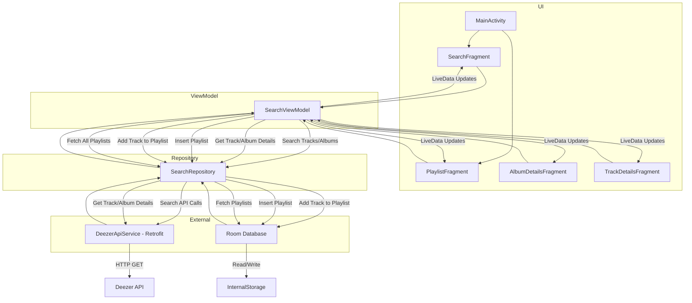

# **Music Search and Playlist Manager App**

## **Overview**

This application provides users with a seamless experience to search for music tracks and albums, view detailed information about them, and manage custom playlists. The app leverages the Deezer API for fetching music data and incorporates robust caching and persistence strategies to enhance user experience.

### **Key Features**

1. **Search Functionality:**
   - Search for tracks or albums using keywords.
   - View search results in a grid layout with album covers and track details.

2. **Detailed View:**
   - Get detailed information about tracks and albums, including contributors, release dates, genres, and more.
   - Play preview clips of tracks.

3. **Playlist Management:**
   - Create, view, and manage custom playlists.
   - Add tracks to playlists directly from the search results.

4. **Intuitive Navigation:**
   - Easily switch between Search and Playlist sections using a bottom navigation bar.

5. **Media Integration:**
   - Glide library for optimized image loading and caching.
   - MediaPlayer for audio playback of track previews.

### **Illustrative Screenshots**
*Screenshots are placeholders as they are unavailable from the provided context. Please include screenshots of search results, detailed track/album views, and playlist management screens here.*

---

## **Technical Architecture**

### **Architecture Overview**

The app follows the **Model-View-ViewModel (MVVM)** architecture to ensure separation of concerns, improved testability, and maintainability.

### **Architecture Diagram**

### **Implementation Choices**

#### **MVVM Pattern**
- **View Layer:** Contains fragments for search, album details, and playlist management. Each fragment interacts with the ViewModel to display data and handle user interactions.
- **ViewModel Layer:** Acts as the logic holder for fetching and managing data. Uses `LiveData` to observe and propagate changes to the UI. Coroutine scopes are utilized for async operations.
- **Repository Layer:** Manages data sources. It checks for cached data in Room first and fetches from the Deezer API using Retrofit if needed.

#### **Caching Mechanism**
- Images are cached using the Glide library, optimizing performance and reducing network calls.
- Tracks, albums, and playlists are stored in a Room database to support offline access and persistent user data.

#### **Recent Searches**
- Recent searches are saved in Room with timestamps to allow users to revisit previous queries.

#### **Retrofit Integration**
- Retrofit and Gson are used for making and parsing network requests to the Deezer API. HTTP logging is added for easier debugging of API calls.

---

## **Unresolved Technical Challenges**

1. **Error Handling:**
   - While basic error handling exists, some edge cases (e.g., network timeouts or partial API responses) need more comprehensive handling.

2. **Playlist Details:**
   - Clicking on a playlist currently shows a placeholder action. The feature to display playlist details and manage tracks within a playlist remains to be implemented.

3. **Search Performance Optimization:**
   - For large datasets, the search and result rendering process can be slow. Implementing pagination or on-demand data loading might improve performance.

4. **Audio Playback Issues:**
   - Playback of track previews occasionally fails due to unsupported formats or network errors. A fallback mechanism is required to improve user experience.

5. **Dark Mode Support:**
   - The app does not yet have a dedicated dark mode. Adding this feature would enhance usability and aesthetics for users preferring darker themes.

---

